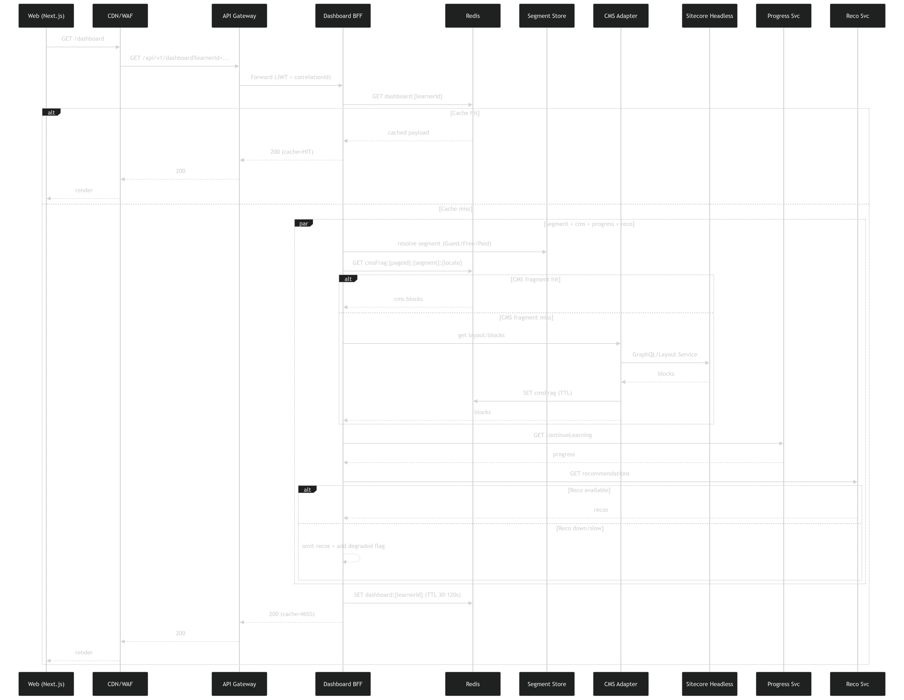
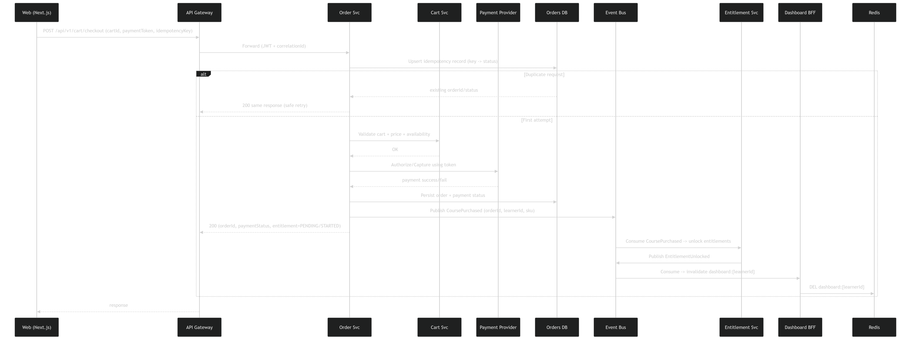

---

# Question 2 – EdTech Platform System Design

**Dashboard + Commerce + Entitlements**

---

# 1. Executive Summary

This document describes the architecture and system design of a scalable EdTech learner platform supporting:

* CMS-driven learner dashboard
* Personalized “Continue Learning”
* Recommendations
* Cart and Checkout
* Payment confirmation
* Course entitlement unlock
* 50K concurrent users
* 99.9% availability
* Dashboard latency targets:

  * <300ms (cached)
  * <800ms (uncached)

The solution applies:

* **KISS** – simple, production-ready architecture
* **DRY** – shared error models, event contracts, and caching strategy
* **SOLID** – clear service boundaries and single responsibility

---

# 2. Scope and Assumptions

## Functional Scope

* Learner dashboard personalized by segment:

  * Guest
  * Free
  * Paid
* CMS is Sitecore Headless
* Checkout with idempotency support
* Payment confirmation
* Event-driven entitlement unlock
* Dashboard refresh after purchase

## Non-Functional Requirements

* 50K concurrent users
* Dashboard p95 latency:

  * <300ms (cached)
  * <800ms (uncached)
* 99.9% availability
* Secure payment handling
* Full observability

---

# 3. High-Level Architecture

## Architecture Overview


---

## 3.1 Key Components

### Edge Layer

* Web (Next.js – SSR + CSR hybrid)
* CDN + WAF

  * Static asset caching
  * DDoS protection
  * TLS termination

### API Layer

* API Gateway

  * JWT validation
  * Rate limiting
  * Correlation ID injection
  * Routing

* Dashboard BFF (Backend for Frontend)

  * Aggregates CMS + Progress + Recommendations
  * Orchestrates caching
  * Returns UI-shaped payload

### Domain Services

| Service                | Responsibility                         |
| ---------------------- | -------------------------------------- |
| CMS Adapter            | Encapsulates Sitecore APIs             |
| Segment Store          | Determines Guest/Free/Paid             |
| Progress Service       | Tracks learner progress                |
| Recommendation Service | Generates personalized recommendations |
| Cart Service           | Manages cart                           |
| Order Service          | Checkout + persistence                 |
| Entitlement Service    | Unlocks purchased courses              |
| Payment Provider       | External payment gateway               |

### Infrastructure

* Redis (caching layer)
* SQL Orders DB
* Event Bus (Kafka / Service Bus)
* Observability stack (Logs, Metrics, Tracing)

---

# 4. Dashboard Design

The dashboard is CMS-driven and personalized.

---

## 4.1 Dashboard Request Flow



---

## 4.2 Flow Breakdown

1. Web calls:

```
GET /api/v1/dashboard?learnerId=123
```

2. CDN forwards request
3. API Gateway validates JWT and injects correlationId
4. Request forwarded to Dashboard BFF

---

## 4.3 Dashboard Cache Strategy

### Layer 1 – Redis (Personalized Cache)

Key:

```
dashboard:{learnerId}
```

TTL:

```
30–120 seconds
```

If cache hit:

* Return immediately
* Latency <300ms

If cache miss:

* Resolve learner segment
* Fetch CMS fragments
* Fetch continue learning
* Fetch recommendations
* Compose payload
* Cache result
* Return response (<800ms target)

---

## 4.4 CMS Integration Strategy

### CMS Adapter Pattern

The BFF never calls Sitecore directly.

CMS Adapter handles:

* GraphQL / Layout Service calls
* Segment resolution
* Fragment caching
* Error isolation

### CMS Cache

Redis key:

```
cms:{pageId}:{segment}:{locale}
```

TTL:

```
5–15 minutes
```

Invalidation:

* Triggered by Sitecore publish webhook

---

## 4.5 Dashboard API Contract

### Request

```
GET /api/v1/dashboard?learnerId={id}
```

### Response

```json
{
  "segment": "PAID",
  "cmsBlocks": [],
  "continueLearning": {
    "courseId": "C101",
    "lessonId": "L3",
    "progressPercent": 42
  },
  "recommendations": [],
  "metadata": {
    "generatedAt": "timestamp",
    "cache": "HIT"
  }
}
```

---

## 4.6 Graceful Degradation

If Recommendation Service:

* Times out
* Is slow
* Is unavailable

BFF:

* Returns dashboard without recommendations
* Adds degraded flag
* Logs warning

Availability is prioritized over completeness.

---

# 5. Checkout and Commerce Design

Checkout must be:

* Idempotent
* Secure
* Event-driven
* Retry-safe

---

## 5.1 Checkout Flow



---

## 5.2 Checkout Request

```
POST /api/v1/cart/checkout
```

### Request Body

```json
{
  "cartId": "CART123",
  "paymentMethodToken": "tok_abc",
  "idempotencyKey": "UUID-123"
}
```

---

## 5.3 Idempotency Handling

Orders DB maintains:

| idempotencyKey | status | storedResponse |

If duplicate request:

* Return stored response
* Prevent double charge

---

## 5.4 Checkout Steps

1. Validate cart
2. Authorize payment
3. Persist order
4. Publish `CoursePurchased`
5. Return response

### Response

```json
{
  "orderId": "ORD123",
  "paymentStatus": "SUCCESS",
  "entitlementStatus": "PENDING"
}
```

---

# 6. Event-Driven Entitlement Unlock

## Event Published

```
CoursePurchased
{
  orderId,
  learnerId,
  courseId
}
```

## Event Consumers

### Entitlement Service

* Unlocks course
* Persists entitlement
* Publishes `EntitlementActivated`

### Dashboard BFF

* Invalidates `dashboard:{learnerId}`

---

## Why Event-Driven?

* Loose coupling
* Retry safety
* Independent scaling
* Resilient processing

---

# 7. Caching Strategy

| Layer             | Purpose              |
| ----------------- | -------------------- |
| CDN               | Static assets        |
| Redis (CMS)       | Segment content      |
| Redis (Dashboard) | Personalized payload |
| DB Indexing       | Fast lookup          |

---

## Cache Invalidation Triggers

| Event            | Action               |
| ---------------- | -------------------- |
| Sitecore Publish | Purge CMS keys       |
| LessonCompleted  | Invalidate dashboard |
| CoursePurchased  | Invalidate dashboard |
| Segment Change   | Invalidate dashboard |

---

# 8. Security and Compliance

## Authentication

* OIDC login
* JWT tokens
* Short-lived access tokens

## Authorization

RBAC roles:

* Guest
* Free Learner
* Paid Learner
* Admin

## Payment Security

* Tokenized payment
* No card storage
* PCI compliance handled by provider

## Data Protection

* PII encrypted at rest
* Logs redact sensitive data
* Secure service-to-service communication

## Rate Limiting

* Enforced at API Gateway
* Stricter limits on checkout endpoint

---

# 9. Observability and Reliability

## Correlation ID

Injected at gateway and propagated across:

* BFF
* Services
* Event Bus

Header:

```
X-Correlation-ID
```

---

## SLIs and SLOs

| Metric                   | Target     |
| ------------------------ | ---------- |
| Dashboard p95 (cached)   | <300ms     |
| Dashboard p95 (uncached) | <800ms     |
| Availability             | 99.9%      |
| Checkout success rate    | >99%       |
| Event processing lag     | <2 seconds |

---

## Logging Strategy

* Structured JSON logs
* Log levels:

  * INFO – business flow
  * WARN – degraded mode
  * ERROR – failure
* No PII in logs

---

# 10. Scalability Strategy

Supports 50K concurrent users through:

* Stateless horizontal scaling
* Redis clustering
* CDN offloading
* BFF aggregation
* Event-driven decoupling

---

# 11. MVP and Phased Delivery

## MVP

* Segmented dashboard
* Checkout with sandbox payment
* Entitlement unlock
* Redis caching
* Basic observability

## Phase 2

* Advanced recommendations
* A/B testing
* Enhanced analytics
* Stronger CMS validation
* Mobile optimization

---

# 12. Architectural Trade-offs

### 1. BFF vs Direct Service Calls

BFF chosen:

* Reduces frontend round-trips
* Optimizes payload per channel
* Centralizes caching

### 2. Event-Driven Entitlement vs Synchronous Unlock

Event-driven chosen:

* Faster checkout response
* More resilient
* Retry-safe

Trade-off: eventual consistency

### 3. Aggressive Caching vs Freshness

Short TTL + event invalidation balances:

* Performance
* Content freshness

---

# 13. Conclusion

This architecture:

* Meets performance SLAs
* Supports 50K concurrent users
* Ensures 99.9% availability
* Uses clean separation of concerns
* Applies KISS, DRY, and SOLID principles
* Is scalable, observable, and production-ready

The system prioritizes:

* Simplicity
* Resilience
* Maintainability
* Developer clarity

---
